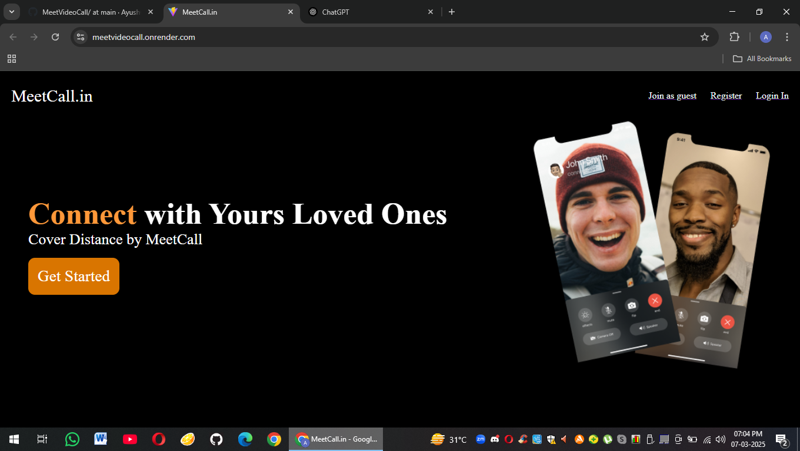

<h1><b>MeetCall.in : </b></h1>
 

MeetCall.in is a modern video call web application designed for seamless real-time communication. It enables users to engage in high-quality one-on-one and group video calls with low latency and secure connections using WebRTC technology.
 
 
 

<h3>1. Planning & Technology Stack Selection </h3>
<b>Tech Stack:</b> 
<ul>
  <li>Frontend: React.js (for UI), Tailwind CSS / Material UI (for styling)</li>
  <li>Backend: Node.js, Express.js (for API & authentication)</li>
  <li>Database: MongoDB / Firebase (for user & call management)</li>
  <li>Real-Time Communication: WebRTC, Socket.io</li>
  <li>Authentication: JWT (JSON Web Tokens) / OAuth</li>
  <li>Hosting & Deployment: Vercel (Frontend), AWS / DigitalOcean / Firebase (Backend)</li>
<ul>

 
<h3>2. Frontend Development</h3> 
✅ Setting Up React with Next.js or Vite – Initialize the project, configure routing, and set up state management using Redux or Context API. 
✅ UI & UX Design – Design the home screen, login/signup pages, call interface, and meeting rooms using Tailwind CSS or Material UI. 
✅ Video Call Interface – Implement video and audio elements using WebRTC. 
✅ Meeting Rooms – Generate unique room links and allow users to join with a simple URL. 
✅ Chat & Screen Sharing – Use WebRTC and Socket.io to enable in-call messaging and screen sharing. 

 
 
<h3>3. Backend Development</h3> 
✅ User Authentication – Implement JWT or OAuth for secure login/signup. 
✅ Call Management API – Create APIs to handle meeting creation, user status, and history. 
✅ WebRTC Signaling Server – Use Socket.io or PeerJS to handle peer-to-peer connection setup. 
✅ Database Setup – Store user info, call history, and chat messages in MongoDB. 
✅ Security & Encryption – Encrypt media streams and use HTTPS for secure connections. 
 
<h3>4. Real-Time Communication with WebRTC </h3>
✅ WebRTC Setup – Implement WebRTC for direct peer-to-peer connections. 
✅ STUN & TURN Servers – Configure STUN/TURN servers for better connectivity in restrictive networks. 
✅ Socket.io for Signaling – Use Socket.io to exchange SDP and ICE candidates between peers. 
✅ Error Handling & Reconnection Logic – Ensure a smooth experience by handling disconnections and reconnects. 
 
<h3>5. Deployment & Optimization</h3>
✅ Deploy Frontend – Use Vercel or Netlify for fast hosting. 
✅ Deploy Backend – Use AWS, DigitalOcean, or Firebase for API and database hosting. 
✅ Optimize Performance – Reduce latency, compress media streams, and improve UX. 
✅ Testing & Bug Fixes – Perform unit and integration testing to ensure a smooth experience. 

<h3>Technologies Used : </h3>
 

  
<h3>Deployed Project Link : </h3>
 
 
  
 
<h3>Demo : </h3> 
 
